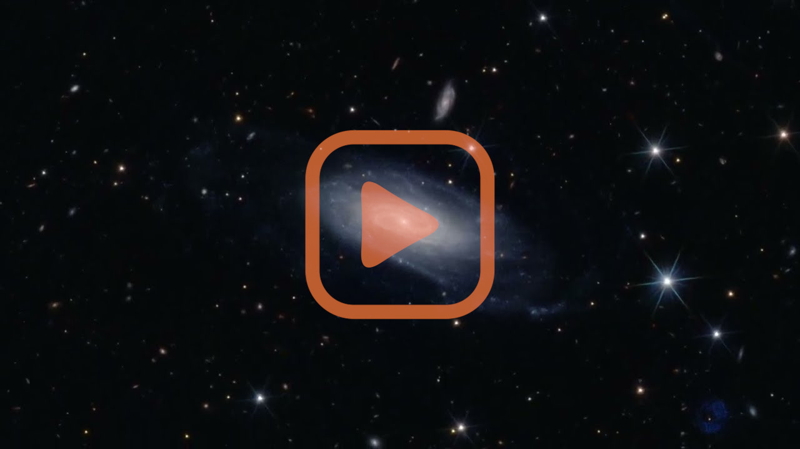

# Bring colors to Euclid tiles!

Azul(ero)* is a toolbox which, among others, provides scripts to download and merge VIS and NIR observations over a MER tile.
For rendering color images, `azul process` detects and inpaints bad pixels (cold pixels, saturated stars...),
and combines the 4 channels (I, Y, J, H) into an sRGB image.
Input data files can be selected with `azul find` and then downloaded with `azul retrieve`,
which connects to public (SAS) or private (EAS) data archives.
Last but not least, `azul roam` produces flowing videos by panning and zooming images.

*I started this project when Euclid EROs came out...

# License

[Apache-2.0](https://raw.githubusercontent.com/kabasset/azulero/refs/tags/v0.1.0/LICENSE)

# Installation and setup

Install the `azulero` package with:

```
pip3 install azulero
```

If you wish to access Euclid-internal data, see [`azul retrieve`](retrieve.md) documentation to configure authentication.

For `azul find`, download the geojson file which monitors MER processing, e.g., for DR1:
[DpdMerFinalCatalog.geojson](https://gitlab.euclid-sgs.uk/sy-tools/ST_SMT_DATA/-/raw/DR1/data/DpdMerFinalCatalog.geojson?ref_type=heads)

# Basic usage

The typical workflow is as follows:

* 🎯 Find the tile indices of your objects or coordinates with `azul find`.
* 📥 Download the individual MER-processed FITS files of your tiles with [`azul retrieve`](retrieve.md).
* ✂️ Optionally select the region to be processed with `azul crop`.
* 🌟 Blend the channels and inpaint artifacts with [`azul process`](process.md).
* 🎬 Generate a video from the image with [`azul roam`](roam.md).

Usage:

```xml
azul [--workspace <workspace>] find [<objects>] [--radec <coordinates>]
azul [--workspace <workspace>] retrieve [--from <provider>] <tile_indices>
azul [--workspace <workspace>] crop <tile_index>
azul [--workspace <workspace>] process <tile_slicing>
azul [--workspace <workspace>] roam <image> <sequence>
```

with:

* `<workspace>` - The [parent directory](workspace.md) to save everything, in which one folder per tile will be created (defaults to the current directory).
* `<object>` - A space-separated list of object names, e.g. `M82 NGC6536`.
* `<coordinates>` - RA/dec coordinates in decimal degrees, e.g. `266.9397155 +64.0472200`; Option `--radec` can be specified multiple times.
* `<provider>` - The data archive name, e.g. `sas` for public releases.
* `<tile_indices>` - The space-separated list of tiles to be downloaded, typically the result of `azul find`.
* `<tile_index>` - A single tile index.
* `<tile_slicing>` - A single tile index, optionally followed by a slicing à-la NumPy, typically the result of `azul crop`.
* `<image>` - The path to an input image (not necessarily produced by Azul).
* `<sequence>` - The roaming configuration file: see the [format description](roam.md) for details.

# Example

Here is an example output:


> A field around [PGC 61356](https://simbad.u-strasbg.fr/simbad/sim-basic?Ident=PGC+61356)

> The two thick blue rings are artifacts of the VIS instrument known as ghosts.
> To my knowledge, the galaxy in the center -- [PGC 61356](https://simbad.u-strasbg.fr/simbad/sim-basic?Ident=PGC+61356) -- has never been resolved this way.
> Rendering the image allowed me to discover this is a splendid polar-ring galaxy!
> The previously unseen golden structure top left may be an Einstein ring, possibly with two deflectors -- the question remains open.

> Credit: ESA Euclid/Euclid Consortium/NASA/Q1-2025/Antoine Basset (CNES)

The picture above was produced by the following commands:

```sh
azul retrieve 102159776 --from sas
azul process 102159776[6000:7000,5000:7000]
```

From the same tile, here is an example over a region with less artifacts:


> A field around [UGC 11116](https://simbad.u-strasbg.fr/simbad/sim-basic?Ident=UGC+11116)

> Credit: ESA Euclid/Euclid Consortium/NASA/Q1-2025/Antoine Basset (CNES)

```
azul process 102159776[11000:12000,7500:9500]
```

The following video was made with `azul roam` (click to play on Youtube):

[](https://www.youtube.com/watch?v=z1-V0zz4p_s)

# Advanced usage

Refer to the dedicated pages:

* [Retrieve](retrieve.md)
* [Process](process.md)
* [Roam](roam.md)

And check the different command help messages:

```sh
azul -h
azul find -h
azul retrieve -h
azul crop -h
azul process -h
azul roam -h
```

# Citing Azulero

💞 If you use this software for academic publications, please cite as reported by `azul cite`.

More details in [CITATION.cff](CITATION.cff).

# How to help?

* [Report bugs, request features](https://github.com/kabasset/azulero/issues), tell me what you think of the tool and results...
* Mention myself (Antoine Basset, CNES) and/or [`Azulero`](https://www.doi.org/10.24400/815952/Azulero)
  when you publish images processed with this tool (see example credits above).
  Cite the software in academic publications (see previous section).
* Share with me your images, I'm curious!

# Contributors

* Mischa Schirmer (MPIA): Azul's color blending is freely inspired by that of Mischa's script `eummy.py`.
* Téo Bouvard (Thales): Drafed `retrieve`.
* Rollin Gimenez (CNES): Fixed packaging, early and long-term beta-tester.
* Kane Nguyen-Kim (IAP): Provided URLs for retrieving public data, early and long-term beta-tester.
* Gian Paolo Candini (CSIC): Investigated rendering issues and improved parametrization.
* Jean-Christophe Malapert (CNES): Implemented spatial operations on the sphere.

# Acknowledgements

* 🚀 Thanks to my CNES and LISA managers, who let me work a bit on this project on open hours!
* 🔥 Congratulations to the whole Euclid community; The mosaics are simply unbelievable!
* 😍 Thank you Euclid astronomers for answering my dummy questions on the contents of the images I posted.
