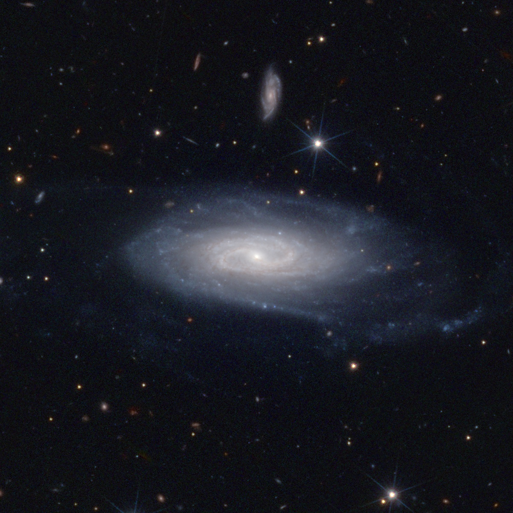

Bring colors to Euclid tiles!
=============================

Azul(ero) [#]_ is a toolbox which, among others, provides scripts to download and process Euclid observations over a MER tile.

For rendering color images, ``azul process`` detects and inpaints bad pixels (cold pixels, saturated stars...),
and combines the 4 channels (I, Y, J, H) into an sRGB image (see :doc:`process`).
Input data files can be selected and downloaded with ``azul retrieve``,
which connects to public (SAS) or private (EAS) data archives (see :doc:`retrieve`).
Last but not least, ``azul roam`` produces flowing videos, for example by panning and zooming images.

Azulero is now compatible with Unix and Windows pipelines, which makes batch processing simple,
including with parallelization (see :doc:`pipelines`).
The image below is the raw output of:

.. prompt:: bash

   azul retrieve UGC11116 -r 1m --from pdr | azul process

   A 2' x 2' field around `UGC 11116 <https://simbad.u-strasbg.fr/simbad/sim-basic?Ident=UGC+11116>`_.

   Credit: ESA Euclid/Euclid Consortium/NASA/Q1-2025/Antoine Basset (CNES)

.. toctree::
   :maxdepth: 1

   quickstart
   install
   news
   interfaces
   retrieve
   process
   roam
   pipelines

.. [#] I started this project when Euclid EROs came out...
