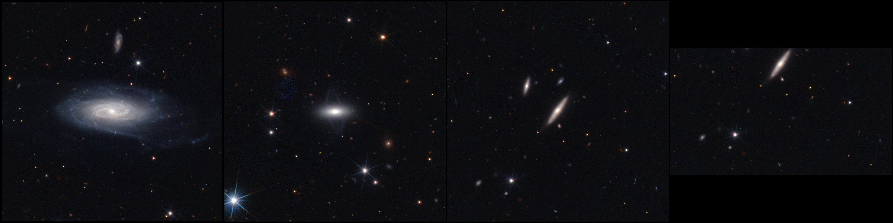

Pipelines
=========

Introduction
------------

Starting from version 2.0, when executed as part of a Unix or Windows pipeline,
Azulero commands can read their positional arguments from the standard input stream (``stdin``),
and write their results to the standard output stream (``stdout``).
Logs are written to the standard error stream (``stderr``).
Moreover, the commands now accept multiple inputs,
which make them suitable for batch processing.

The following sections demonstrate classical use cases.
Basic knowledge on pipelines and standard streams
-- at least, knowing operator ``|`` -- is required.
For the sake of simplicity (and sanity), we'll illustrate the features for Bash on Unix systems only.
Translation to Windows is left as an exercise!

For a better understanding of what actually happens,
the last section dissects the data flow of a simple pipeline.

The results will be presented for public Q1 data only;
set the following environment variables in order to reproduce the images exactly (see :ref:`named_options`):

.. prompt:: bash

   export AZULRETRIEVE_FROM=pdr
   export AZULRETRIEVE_DSR=Q1_R1

Credit for all images and videos in this page:

   ESA Euclid / Euclid Consortium / NASA / Q1-2025 / Antoine Basset (CNES).

Pipeline: Object names to color images
--------------------------------------

The simplest use case for an Azulero pipeline is to download MER data and render color images.
In this example, we will use galaxy names as input:

.. prompt:: bash

   azul retrieve UGC11116 PGC61356 -r 1m | azul process

Note that several MER tiles may contain a given target,
such that more than two images may be rendered.
If this is unwanted, set option ``-n 1``.
Conversely, several targets may belong the same tile,
which is the case for those two galaxies in `Q1 tile 102159776 <https://www.youtube.com/watch?v=z1-V0zz4p_s>`_.

The above command will generate two images:

.. subfigure:: AB
   :gap: 1em

   .. image:: _static/UGC11116_102159776_adjusted.jpg

   .. image:: _static/PGC61356_102159776_adjusted.jpg

   Color rendering of 2' x 2' cutouts around UGC11116 and PGC61356.

The resulting workspace contains two workdirs which share a common tile folder:

.. plantuml::
   :max-width: 100%

   @startfiles
   /102159776/PGC61356/EUC_MER_BGSUB-MOSAIC-NIR-H_TILE102159776-9A9A41_20241024T223843.133644Z_00.00.fits
   /102159776/PGC61356/EUC_MER_BGSUB-MOSAIC-NIR-J_TILE102159776-A30311_20241024T223448.200678Z_00.00.fits
   /102159776/PGC61356/EUC_MER_BGSUB-MOSAIC-NIR-Y_TILE102159776-F70908_20241024T222851.359405Z_00.00.fits
   /102159776/PGC61356/EUC_MER_BGSUB-MOSAIC-VIS_TILE102159776-ACB359_20241025T034718.289475Z_00.00.fits
   /102159776/PGC61356/PGC61356_102159776.tiff
   /102159776/UGC11116/EUC_MER_BGSUB-MOSAIC-NIR-H_TILE102159776-9A9A41_20241024T223843.133644Z_00.00.fits
   /102159776/UGC11116/EUC_MER_BGSUB-MOSAIC-NIR-J_TILE102159776-A30311_20241024T223448.200678Z_00.00.fits
   /102159776/UGC11116/EUC_MER_BGSUB-MOSAIC-NIR-Y_TILE102159776-F70908_20241024T222851.359405Z_00.00.fits
   /102159776/UGC11116/EUC_MER_BGSUB-MOSAIC-VIS_TILE102159776-ACB359_20241025T034718.289475Z_00.00.fits
   /102159776/UGC11116/UGC11116_102159776.tiff
   @endfiles

We have generated the color images one after the other by executing a single ``azul process`` command,
but it is possible to parallelize the pipeline, for example with ``xargs``:

.. prompt:: bash

   azul retrieve UGC11116 PGC61356 -r 1m \
   | xargs -n 1 -P 4 azul process

where ``-n 1`` is the number of targets passed to each ``azul process`` command,
and ``-P 4`` is the maximum number of parallel executions.

Similarly, the retrieval can be parallelized:

.. prompt:: bash

   echo UGC11116 PGC61356 \
   | xargs -n 1 -P 4 azul retrieve -r 1m \
   | xargs -n 1 -P 4 azul process

Pipeline: Online catalog to collage
-----------------------------------

Let us run Azulero on the lens catalog which was used to render
`the Q1 strong lensing collage <https://www.esa.int/ESA_Multimedia/Images/2025/03/Strong_gravitational_lenses_captured_by_Euclid>`_
and generate a similar output in one pipeline:

.. prompt:: bash

   wget -q -O - https://zenodo.org/records/15025832/files/q1_discovery_engine_lens_catalog.csv \
   | tail -n+2 \
   | sort -r -t ',' -k 8 \
   | head -112 \
   | cut -d ',' -f 5,6 \
   | azul retrieve -n 1 -r 5s \
   | azul process \
   | azul arrange -n 14 \
   | xargs open 

The above pipeline performs the following:

* download the catalog into ``stdout``,
* remove the header row,
* sort rows by descending flux,
* keep 14 x 8 = 112 targets,
* select RA and Dec columns,
* retrieve one 10" x 10" cutout per target,
* render a color image per cutout,
* arrange renderings into a 14-column grid,
* display the resulting collage:

.. figure:: _static/collage_56.46762095259402,-49.45093443791871_102020055_adjusted_56.46762095259402,-49.45093443791871_102020055_adjusted.png

   Collage of 10" x 10" cutouts around Q1 strong lenses.

Pipeline: Clipboard to slideshow
--------------------------------

This example is a bit more exotic than the others, but parts of it may come in handy.
We will get the list of targets from the clipboard and generate a video from the renderings.
To this end, we will rely on ImageMagick's ``convert``, which can turn a sequence of images into a video as follows:

.. code-block:: xml

   convert -delay <duration> <images> <video>

where:

* ``<duration>`` is the duration of each image in centiseconds,
* ``<images>`` is the space-separated list of input images,
* ``<video>`` is the path to the output video.

As targets, we will use Q1 nearby galaxies.
The pipeline will be fed by the clipboard, therefore we will just select the table at the bottom of
`this page <https://www.cosmos.esa.int/web/euclid/euclid-nearby-galaxies-collage>`_ and run:

.. prompt:: bash

   xclip -o \
   | sed 's/ //g' \
   | azul retrieve -n 1 -r 30s \
   | azul process \
   | cat - <(echo " slideshow.mp4") \
   | xargs convert -delay 50

where:

* ``xclip`` (which you may need to install) prints the selection to ``stdout``;
* ``sed`` removes spurious spaces, e.g. ``PGC 2693358`` is transformed into ``PGC2693358``;
* ``azul retrieve`` downloads 1' x 1' cutouts;
* ``azul process`` renders the images and returns the paths;
* ``cat`` appends the output video filename to the rendering paths for ``convert``;
* ``convert`` generates the video:

.. video:: _static/slideshow.mp4
   :align: center
   :caption: Slideshow of 1' x 1' cutouts of Euclid Q1 nearby galaxies. 

Dissecting a pipeline
---------------------

Let us introduce a simple and typical example pipeline:

.. prompt:: bash

   echo UGC11116 PGC61356 LEDA2697349 \
   | azul retrieve -r 1m \
   | azul process \
   | azul arrange --format max \
   | xargs open

which gives:

   Collage of 2' x 2' cutouts around UGC11116, PGC61356 and LEDA2697349.

Since we did not pass option ``-n 1`` to ``azul retrieve``,
all of the tiles which contain a target are retrieved,
which is why there are two images of LEDA2697349.
One of them is incomplete because the whole 2' x 2' cutout doesn't fit inside the second tile.
With option ``-n``, the tiles would have been sorted by coverage in order to retrieve complete cutouts in priority.
Finally, ``azul arrange``'s option ``--format max`` is used to pad the smallest cutout instead of cropping the largest ones.

The message flow is illustrated below:

.. plantuml::
   :align: center
   :max-width: 100%

   skinparam backgroundColor transparent
   skinparam componentstyle rectangle
   left to right direction

   object echo {
   }
   component targets #FFFFFF [
   UGC11116 PGC61356 LEDA2697349
   ]
   object "azul retrieve" as retrieve {
   }
   component workdirs #FFFFFF [
   102159776/UGC11116
   102159776/PGC61356
   102160059/LEDA2697349
   102159776/LEDA2697349
   ]
   object "azul process" as process {
   }
   component renderings #FFFFFF [
   102159776/UGC11116/UGC11116_102159776.tiff
   102159776/PGC61356/PGC61356_102159776.tiff
   102160059/LEDA2697349/LEDA2697349_102160059.tiff
   102159776/LEDA2697349/LEDA2697349_102159776.tiff
   ]
   object "azul arrange" as arrange {
   }
   component collage #FFFFFF [
   collage_UGC11116_102159776_LEDA2697349_102159776.png
   ]
   object open {
   }

   echo - targets
   targets -> retrieve
   retrieve - workdirs
   workdirs -> process
   process - renderings
   renderings -> arrange
   arrange - collage
   collage -> open

* ``echo`` streams the targets toward ``azul retrieve``.
* ``azul retrieve`` streams the workdirs toward ``azul process``.
* ``azul process`` streams the paths to the renderings toward ``azul arrange``.
* ``azul arrange`` streams the path to the collage file toward ``open``.
