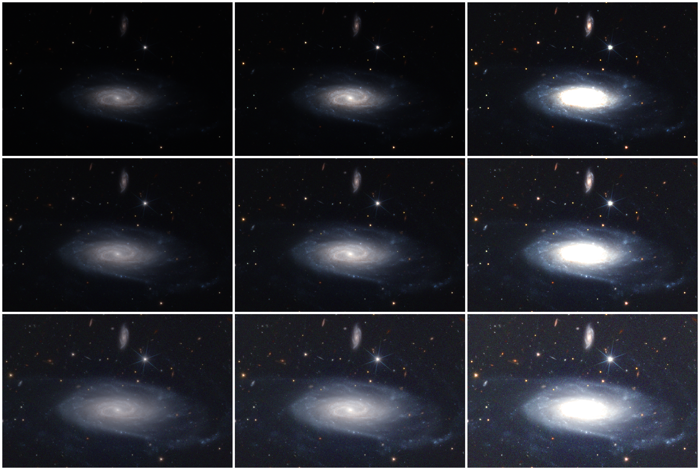

``azul process``
================

Overview
--------

Command ``azul process`` generates a defect-inpainted color image of a tile or tile cutout
from input MER images generally retrieved with ``azul retrieve``.
It takes as input workdirs which each contain at least one such MER image per Euclid photometric band (I, Y, J, H),
and outputs one color rendering per workdir.
Intermediate files can be written, mostly for debugging purposes.

The diagram below illustrates the various steps of the algorithm processing a single workdir.

.. plantuml::
   :align: center
   :max-width: 100%

   skinparam backgroundColor transparent

   folder workdir {
   }
   object Stack {
   }
   object Inpaint {
   }
   object Sharpen {
   --fwhm
   --strength
   }
   object Equalize {
   --zero
   --scaling
   }
   object Stretch {
   -w
   -a
   -b
   }
   object Blend {
   --ib
   --yg
   --jr
   --nirl
   }
   object Adjust {
   --hue
   --saturation
   --curves
   }

   workdir --> Stack
   Stack -> Inpaint
   Inpaint -> Sharpen
   Sharpen -> Equalize
   Equalize -> Stretch
   Stretch -> Blend
   Blend -> Adjust

   file mask {
   }
   file blended {
   }
   file adjusted {
   }

   Inpaint --> mask
   Blend --> blended
   Adjust --> adjusted

Inputs
------

Input files are discovered according to their names in the workdir (see :ref:`workspace`) and a glob pattern.
For more details, see help messages of global options ``--workspace`` and ``--input``:

.. prompt:: bash

   azul -h

Outputs
-------

The script results in a 16-bit TIFF, 8-bit PNG or 8-bit compressed JPG
depending on the extension of the file name parameter (``-o``).

WCS parameters are written as follows:

* TIFF outputs contain WCS parameters as ``ImageDescription`` metadata,
  for compatibility with euniverse_;
* PNG and JPEG outputs are accompanied with YAML files containing WCS parameters,
  named after the image file with ``.wcs`` extension.

The value passed to ``-o`` is a template in which the placeholders are rendered as follows.

================ ==================
Placeholder name Substitution value
================ ==================
``{workspace}``  Workspace path
``{workdir}``    Workdir path relative to the workspace
``{tile}``       First part of the workdir
``{target}``     Last part of the workdir if it has several parts, otherwise ``Tile``
``{step}``       Name of the current step output (see below)
================ ==================

Intermediate images are saved when the template contains ``{step}``.
The latter will be replaced with the name of the intermediate step as follows:

* ``mask`` -- The color-coded bad pixel map, where 0 means the pixel is good,
  and grey (resp. blue, green, red) means the I (resp. Y, J, H) channel is bad.
* ``blended`` -- The RGB image before color and curve adjustment.
* ``adjusted`` -- The RGB image after color and curve adjustment, if any.

For example, using the template ``{workspace}/{workdir}/{target}_{tile}_{step}.tiff``,
the inpainting mask tile 102159776 will be saved as ``Tile_102159776_mask.tiff`` in the workdir.
If, instead, ``-o {tile}.jpg`` is used, then the output will be a JPG file in the current directory
accompanied by a ``.wcs`` file, and no intermediate steps will be saved.

Stacking
--------

If several images are provided for a given band, they are median-stacked.
No alignment is performed, since we assume the images are already MER-aligned.

Inpainting
----------

Pixels with a null value after stacking are inpainted, but some defects may remain.
Relying on bitmasks to detect them and decide on the inpainting technique would be nice, especially for VIS ghosts,
yet we did not find a satisfying selection method, which would work both for WIDE and DEEP tiles.
We keep this in mind for a future version...

Sharpening
----------

Band-wise sharpening is performed according to the empirical PSF width, using unsharp mask filtering.
The sharpening strength can be adjusted with ``--strength``.
The PSF width parameter (``--fwhm``) should generally not be changed.

Equalization
------------

Bands are scaled according to their zero-point,
and white balance is controlled with a scaling parameter (``--scaling``).
The zero-point parameter (``--zero``) should generally not be changed.

The conversion between input intensity :math:`f` and AB magnitude :math:`m_\mathrm{AB}` is given by:

.. math::

   m_\mathrm{AB} = 2.5 \log_{10}(f) + \mathrm{ZP}

with ZP the zero-point.

Stretching
----------

The dynamic range is asinh-scaled, which yields pleasing results for both low- and high-energy regions.
The function is linear-like for low values and log-like for high values.
Scaling is controlled by:

* the white point (``-w``),
* an offset (``-b``), which is the opposite of the black point,
* a stretching parameter (``-a``) which sets the transition point between linear-like scaling and log-like scaling.

All of them are expressed in AB magnitude, therefore a higher value corresponds to a lower intensity.

In general, only the white point has to be adjusted, especially for very bright sources.
Typically, the Cat's eye nebula is best rendered with a white point around 18.
Special value ``-w 0`` triggers data-driven tuning based on image statistics.
It generally gives good results, but using it will prevent stitching multiple images,
since they will be rendered with inconsistent stretching parameters.

.. plantuml::
   :max-width: 100%

   @startchart
   title "Stretching curve for various values of a (with w = 22.5 and b = 28.5)"
   h-axis "input" 0 --> 1 spacing 1 label-right
   v-axis "stretched" 0 --> 1 spacing 1 label-top
   line "a = 29" [(0.0, 0.1566693273236386), (0.0025000000000000005, 0.26751941663491213), (0.010000000000000002, 0.42054499330650014), (0.022500000000000006, 0.5213702076810071), (0.04000000000000001, 0.5937424146421468), (0.0625, 0.6500126348281552), (0.09000000000000002, 0.696022297131805), (0.12250000000000003, 0.7349338993349093), (0.16000000000000003, 0.7686449691032505), (0.2025, 0.7983821606048738), (0.25, 0.8249839288823392), (0.30250000000000005, 0.8490486561475633), (0.3600000000000001, 0.871018313242587), (0.42250000000000004, 0.8912286060955338), (0.4900000000000001, 0.9099405182020133), (0.5625, 0.9273609580163409), (0.6400000000000001, 0.9436567350792956), (0.7225000000000001, 0.9589642944866931), (0.81, 0.9733966661283485), (0.9025000000000001, 0.9870485332838725), (1.0, 1.0)] #F88
   line "a = 27" [(0.0, 0.0488784634166931), (0.0025000000000000005, 0.07976275599379179), (0.010000000000000002, 0.1658922792796087), (0.022500000000000006, 0.27484067675024926), (0.04000000000000001, 0.37445609923347567), (0.0625, 0.45798501027078065), (0.09000000000000002, 0.528093480047535), (0.12250000000000003, 0.5880162185258003), (0.16000000000000003, 0.6401835286676365), (0.2025, 0.6863155911936527), (0.25, 0.7276400963687304), (0.30250000000000005, 0.7650535088865191), (0.3600000000000001, 0.7992267100085552), (0.42250000000000004, 0.8306733581107195), (0.4900000000000001, 0.8597948144236073), (0.5625, 0.8869103521523775), (0.6400000000000001, 0.9122779626934736), (0.7225000000000001, 0.9361090171057448), (0.81, 0.9585788175463841), (0.9025000000000001, 0.979834337652556), (1.0, 1.0)] #000
   line "a = 25" [(0.0, 0.01310069295425506), (0.0025000000000000005, 0.021328871364393293), (0.010000000000000002, 0.045962219571342174), (0.022500000000000006, 0.08655093992199117), (0.04000000000000001, 0.14148527048102963), (0.0625, 0.20735322327317474), (0.09000000000000002, 0.2793484775656738), (0.12250000000000003, 0.3527557343730836), (0.16000000000000003, 0.4242178117457414), (0.2025, 0.49195163043381296), (0.25, 0.5553056269589933), (0.30250000000000005, 0.6142556383963345), (0.3600000000000001, 0.6690653320347311), (0.42250000000000004, 0.7201019431888923), (0.4900000000000001, 0.7677479198304585), (0.5625, 0.8123629772920163), (0.6400000000000001, 0.8542705654407106), (0.7225000000000001, 0.8937554628731269), (0.81, 0.9310660589387107), (0.9025000000000001, 0.9664183083145972), (1.0, 1.0)] #8F8
   line "a = 23" [(0.0, 0.005058718071958012), (0.0025000000000000005, 0.00823546215909056), (0.010000000000000002, 0.017765195752798196), (0.022500000000000006, 0.03364343358957012), (0.04000000000000001, 0.0558527714179558), (0.0625, 0.0843482212135041), (0.09000000000000002, 0.11903750218882747), (0.12250000000000003, 0.1597578970576535), (0.16000000000000003, 0.206252637828269), (0.2025, 0.2581512749687633), (0.25, 0.3149594402619159), (0.30250000000000005, 0.3760629533854005), (0.3600000000000001, 0.4407487497313035), (0.42250000000000004, 0.5082409667414367), (0.4900000000000001, 0.5777462176315283), (0.5625, 0.6484995627531843), (0.6400000000000001, 0.7198031103326812), (0.7225000000000001, 0.7910521122756975), (0.81, 0.8617472725981691), (0.9025000000000001, 0.9314951295268422), (1.0, 1.0)] #88F
   legend right
   @endchart

   
   UGC 11116 rendering for a = 25.75 (top row), 27 (middle row), 28.25 (bottom row)
   and w = 20 (left column), 22.5 (center column), 25 (right column)

For the record, this collage was produced with:

.. prompt:: bash

   azul retrieve -r 1m -n 1 UGC11116
   for a in 25.75 27 28.25; do for w in 20 22.5 25; do \
   azul process 102159776/UGC11116[300:1100,:1200] -w $w -a $a -o $w-$a.png; \
   done; done | azul arrange -n 3 --background 255 -o matrix.png

Blending
--------

.. plantuml::
   :align: center
   :max-width: 100%

   skinparam backgroundColor transparent
   left to right direction

   card L #FFFFFF
   card VIS
   card NIR
   card I
   card Y
   card J
   card H
   card B #8888FF
   card G #88FF88
   card R #FF8888

   L <-- NIR : nirl
   L <-- VIS
   VIS <-- I
   NIR <-- Y
   NIR <-- J
   NIR <-- H

   I --> B : ib
   Y --> B
   Y --> G : yg
   J --> G
   J --> R : jr
   H --> R

The blending generates an RGB image from four input channels.
We decide to keep the wavelength ordering: I < Y < J < H.
Two adjacent input channels may contribute to an output channel, e.g. Y and J may contribute to G.
An input channel may contribute to two adjacent output channels, e.g. Y may contribute to B and G.

In order to maximize resolution while retaining very red objects,
a intermediate lightness map (L) is built from the VIS (I) intensity and average NIR intensity
(specifically, the median stacking of YJH).
Resolution in VIS is better than in NIR,
therefore it has higher weight in the output lightness.

The different weight parameters control the different blending contributions:
``--ib`` (resp. ``--yg``, ``--jr``, ``--nirl``) control the relative contribution
of I (resp. Y, J, NIR) to B (resp. G, R, L).
As default parameters, we have chosen to use only I to generate B, and to compress YJH into GR.
Other research groups made different choices
like skipping completely J for ERO images,
using I only for L and YJH for RGB in many articles,
or merging YJ into G and use only H for R in the eummy_ package.
The default parameters of Azulero were challenged on thousands of various objects and always gave pleasant results.
That being said, there is no good or bad approach and you can create your own palette by varying the blending parameters.

Adjustment
----------

Before combining the intermediate RGB and L channels,
hue is rotated (parameter ``--hue``) and saturation is boosted (``--saturation``).

The intensity of each color channel is then adjusted using splines
similar to Photoshop and Gimp curves (``--curves``).

All adjustments can be disabled by setting ``--hue 0 --saturation 1 --curves ""``.

Resources and cropping
----------------------

In its current version, the script may be very memory-greedy for full tiles.
Below is a typical profiling for DEEP and WIDE tiles, including elapsed time and peak RAM usage for each step.
Theses numbers are logged step-by-step during the execution of ``azul process``.
Walltime will depend on the CPU while RAM usage should be stable across architectures.

========== ============ ============
Step       10k x 10k px 20k x 20k px
========== ============ ============
Reading     10 s,  3 GB  10 s,  6 GB
Inpainting  25 s,  6 GB 110 s, 21 GB
Sharpening   5 s,  3 GB  70 s, 12 GB
Stretching   5 s,  2 GB  25 s,  8 GB
Blending    20 s,  6 GB  70 s, 22 GB
Adjustment  10 s,  4 GB  25 s, 12 GB

OVERALL     75 s,  6 GB 310 s, 22 GB
========== ============ ============

Scalability is roughly linear, such that you should be able to interpolate the needs wrt. the input shape.
In order to lower the memory consumption, it is possible to crop the image with numpy's syntax,
e.g. for the top-left quarter (x < 5000, y >= 5000):

.. prompt:: bash

   azul process 102159776[5000:,:5000]

Depending on your system, it may be necessary to add quotes:

.. prompt:: bash

   azul process "102159776[5000:,:5000]"

.. _eummy: https://github.com/schirmermischa/eummy
.. _euniverse: https://github.com/schirmermischa/euniverse